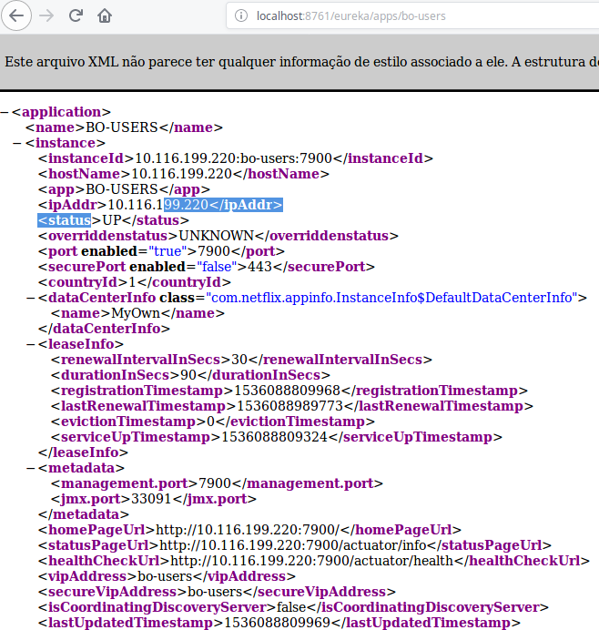

# Eureka Server 

You can use Eureka’s REST API to see the contents of the registry. To see all the
instances of a service, hit the following GET endpoint:

***http://<eureka service>:8761/eureka/apps/<APPID>***

***Example: http://localhost:8761/eureka/apps/bo-users***

